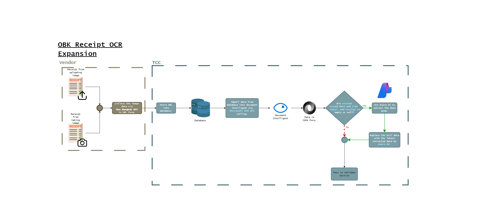

# Azure OCR Pipeline

An automated document processing pipeline that extracts text and structured data from receipts and documents using Azure Document Intelligence (formerly Form Recognizer).



## Project Overview

This pipeline streamlines document processing consist of 2 main parts

### 1. OCR

1. Retrieving Receipt images by URL.
2. Processing them with Azure Document Intelligence OCR services
3. Extracting structured data into JSON format and raw data
4. If date, time, total amount, receipt number, tax id, merchant name failed to extract, pass the image to Azure Ai (Content Understanding)
5. Fill null fields from Azure Ai result.

### 2. Validation logics

#### There are 6 steps to validate documents

- OCV: Check mandatory fields
- RV1: Validate tax_id and merchant_name
- RV2: Validate mall_name and address
- RV3: Validate transaction date
- RV4: Validate duplicates by hashed id
- RV5: Validate doc_type

6. Pass extracted receipt from OCR to validation block to check validity and convert total, total_price to string and add remark key to store keys that have None values.
7. Return extracted receipt as json format with additional keys status (valid or invalid receipt), message (valid or error message), remark (store keys with None values)

## Key Features

- **Document Processing**: Extracts text from receipts and documents
- **Batch Processing**: Processes multiple documents from blob storage
- **Data Extraction**: Parses receipts into structured data including:
  - Tax id of the company
  - Merchant name information which is store name or company name
  - Transaction date
  - Transaction time
  - Items which contain
    - Description
    - Quantity
    - Total price
  - Receipt number
  - Address of the store
  - Unit number of the store
  - Mall name where the store locates
  - Hashed id for checking duplicates
- **Integration Options**:
  - Azure Blob Storage for document management
  - Azure OpenAI for advanced analysis capabilities

## Setup Instructions

### Prerequisites

- Azure subscription with access to:
  - Azure Blob Storage
  - Azure Core
  - Azure Document Intelligence == 1.0.1
  - Azure OpenAI service (optional)
- Python >= 3.10, < 3.12

### API Version Note

In `helper/azure_ai.py`. There are setting about azure api version. The current version available right now from Microsoft is `preview version`.

No library need to install. `Ai Foundry` provide code written is this file.

In the future, if `Azure Content Understanding` have library available and change version. This script will have to refactor and write a new one.

```python
    settings = Settings(
        endpoint="https://au-east-ai-services.cognitiveservices.azure.com/",
        api_version="2024-12-01-preview",
        # Either subscription_key or aad_token must be provided. Subscription Key is more prioritized.
        subscription_key=config["az_content_understanding_key"],
        # aad_token="AZURE_CONTENT_UNDERSTANDING_AAD_TOKEN",
        # Insert the analyzer name.
        analyzer_id="obk-ocr2",
        # Insert the supported file types of the analyzer.
        file_location=file_content,
    )
```

### Environment Setup

1. Clone this repository:

```
git clone https://git.lab.tcctech.app/ds-and-ml-research-sandbox/ai-ml-services/azure-ocr-pipeline.git
cd azure-ocr-pipeline
```

2. Create a virtual environment and install dependencies:

```
python -m venv venv
# On Mac: source venv/bin/activate
# On Windows: venv\Scripts\activate
pip install -r requirements.txt
```

3. Create a `.env` file in the project base on `.env_sample`

## Usage

To extract data from a single image.

1. Start the API server:

   ```bash
   uvicorn main:app --host 0.0.0.0 --port 8000
   ```

2. Send a POST request to the API endpoint (e.g. `/receipt-ocr`) with your image URL or file path in the request body.

   Example using `curl`:

```bash
   curl -X POST "http://localhost:8000/receipt-ocr" \
        -H "Content-Type: application/json" \
        -d '{"source": "<IMAGE_URL_OR_PATH>"}'
```

## Example results

#### Case: 200

```json
{
  "merchant_name": "Brewing Happiness Co.,Ltd.",
  "transaction_date": "2025-02-04",
  "transaction_time": "14:04",
  "items": [
    {
      "description": "Iced Americano - Floral",
      "quantity": 1,
      "total_price": "55.00"
    },
    {
      "description": "Iced Cappuccino - Floral",
      "quantity": 1,
      "total_price": "55.00"
    }
  ],
  "total": "110.00",
  "tax_id": "105560101035",
  "receipt_no": "10344001022500156",
  "address": "1877 One Bangkok Parade Building 1520 RoomRama4 Rd. Lumpini Pathumwan Bangkok 10330",
  "unit_no": "1520",
  "mall_name": "One Bangkok",
  "hashed_receipt": "e6c8d18f08a8632c8c313218d0d6270d57a117215dc6d7a1eab4b313af16da36",
  "status": "valid",
  "message": "valid",
  "remarks": []
}
```

#### Case: 200 but have Null

```json
{
  "merchant_name": "Thai yamazaki Co.,Ltd.",
  "transaction_date": "2025-06-23",
  "transaction_time": "14:04",
  "items": [
    { "description": "บัตเตอร์เฟร้นซ์", "quantity": 1, "total_price": null },
    { "description": "พายไก่", "quantity": null, "total_price": null }
  ],
  "total": "55.0",
  "tax_id": "0125560008744",
  "receipt_no": "10344001022500156",
  "address": null,
  "unit_no": null,
  "mall_name": "One Bangkok",
  "hashed_receipt": "54241a863f9bdf7760556e4b68c49659bfacf4c7715513125451c45d6297b59d",
  "status": "valid",
  "message": "valid",
  "remarks": [
    "address",
    "unit_no",
    "items_total_price_0",
    "items_quantity_1",
    "items_total_price_1"
  ]
}
```

#### Case: Logic OCV-1

```json
{
  "detail": {
    "status": "invalid",
    "http_status": 422,
    "messege": "Could not read required information from receipt.",
    "step": "ocv1",
    "extracted_data": {
      "merchant_name": "MF Cafe & Restaurant Co., Ltd.",
      "transaction_date": null,
      "transaction_time": null,
      "items": [
        {
          "description": "FREE CHZ TOAST",
          "quantity": null,
          "total_price": "0.0"
        },
        {
          "description": "MEM SALAD BAR",
          "quantity": null,
          "total_price": "199.0"
        },
        {
          "description": "Mem Salad 159",
          "quantity": null,
          "total_price": "40.0"
        }
      ],
      "total": "159.0",
      "tax_id": "0105542082482",
      "receipt_no": "15249",
      "address": "SLRT LIMITED-One Bangkok",
      "unit_no": null,
      "mall_name": "One Bangkok",
      "hashed_receipt": "d988b90e9f618a3b44b79c8ae852e2feba0f8904cb7da860bd625482e861a525"
    }
  }
}
```

#### Case: Logic RV-1

```json
{
  "detail": {
    "status": "invalid",
    "http_status": 422,
    "messege": "Receipt is not from a participating store.",
    "step": "rv1",
    "extracted_data": {
      "merchant_name": "一人焼肉推奨店",
      "transaction_date": "2025-01-23",
      "transaction_time": "18:21",
      "items": [
        {
          "description": "เซตหมูทริโอ 150กรัม",
          "quantity": 1,
          "total_price": "289.0"
        },
        {
          "description": "ชาเขียวไม่มีน้ำตาล",
          "quantity": 1,
          "total_price": "39.0"
        },
        {
          "description": "Ice",
          "quantity": 1,
          "total_price": "2.0"
        },
        {
          "description": ":A0_สาหร่ายโรยข้าว",
          "quantity": 1,
          "total_price": "19.0"
        },
        {
          "description": "กิมจิ",
          "quantity": 1,
          "total_price": "30.0"
        }
      ],
      "total": "379.0",
      "tax_id": "250123",
      "receipt_no": "000-29108",
      "address": "Unit 1B132, B1 floor,\n1877, Witthayu Rd, Lumphini,\nPathum Wan, Bangkok 10330",
      "unit_no": "1B132",
      "mall_name": null,
      "hashed_receipt": "75adc15191f38d4e5e09871646a1ecbd414e952e7d68f8e5db6bffc87f23da19"
    }
  }
}
```

#### Case: Logic RV-2

```json
{
  "detail": {
    "status": "invalid",
    "http_status": 422,
    "messege": "Receipt location not recognized as One Bangkok.",
    "step": "rv2",
    "extracted_data": {
      "merchant_name": "DQ CASHIER",
      "transaction_date": "2025-01-23",
      "transaction_time": "18:24",
      "items": [
        {
          "description": "BZ TOFFEE CAKE S",
          "quantity": null,
          "total_price": "49.0"
        }
      ],
      "total": "49.0",
      "tax_id": "0105525046201",
      "receipt_no": "37438",
      "address": null,
      "unit_no": null,
      "mall_name": null,
      "hashed_receipt": "2a3495efb57eef7997f1961874f0ddf9de801b22cec3e0754cfb2cb9e04ae509"
    }
  }
}
```

#### Case: Logic RV-3

```json
{
  "detail": {
    "status": "invalid",
    "http_status": 422,
    "message": "Receipt is too old to redeem.",
    "step": "rv3",
    "extracted_data": {
      "merchant_name": "RISE COFFEE",
      "transaction_date": "2025-01-23",
      "transaction_time": "12:13",
      "items": [
        {
          "description": "ICED SUPER MATCHA",
          "quantity": 1,
          "total_price": "140"
        },
        {
          "description": "DIRTY CEREAL KILLER",
          "quantity": 5,
          "total_price": "675"
        },
        {
          "description": "MATCHA MUSCAT",
          "quantity": 2,
          "total_price": "280"
        },
        {
          "description": "BLACK FIZZ",
          "quantity": 1,
          "total_price": "140"
        }
      ],
      "total": "1235",
      "tax_id": "0105563069396",
      "receipt_no": "E010030002A8774 RC2025/00002785",
      "address": "เลขที่ 199 อาคารเดอะสตอรี่ส์ ห้องเลขที่\n2B120-2B121 ชั้น B1 ถ.วิทยุ แขวงลุมพินี เขต\nปทุมวัน กรุงเทพมหานคร 10330",
      "unit_no": "2B120-2B121 ชั้น B1 ถ.วิทยุ แขวงลุมพินี เขต",
      "mall_name": "One Bangkok",
      "hashed_receipt": "ee1494e015ddfcd91af25841f2b8ec400028a929f4d14092d66d6eaddfeef9ac"
    }
  }
}
```

#### Case: Duplicate Hash ID (Logic RV-4)

```json
{
  "detail": {
    "status": "invalid",
    "http_status": 422,
    "messege": "This receipt has already been redeemed.",
    "step": "rv4",
    "extracted_data": {
      "merchant_name": "ONE TO TWO",
      "transaction_date": "2025-01-21",
      "transaction_time": "18:38",
      "items": [
        {
          "description": "COCOA - ICED",
          "quantity": 1,
          "total_price": "65.0"
        }
      ],
      "total": "65.0",
      "tax_id": null,
      "receipt_no": "35",
      "address": "ห้อง 16114 ชั้นชา โครงการ วันแบงค็อก ถนนวิทยุ\nแขวงลุมพินี เขตปทุมวัน กรุงเทพมหานคร 10330",
      "unit_no": null,
      "mall_name": "One Bangkok",
      "hashed_receipt": "dd4a4dd04ac152516cea5dbcb4584760043519f8ed0453bce454acfbd7b0f5cb"
    }
  }
}
```

#### Case: Handle Error when Hash ID is null or empty string

```json
{
  "detail": {
    "status": "invalid",
    "http_status": 422,
    "messege": "This hashed receipt is not valid.",
    "step": "rv4",
    "extracted_data": {
      "merchant_name": "ONE TO TWO",
      "transaction_date": "2025-01-21",
      "transaction_time": "18:38",
      "items": [
        {
          "description": "COCOA - ICED",
          "quantity": 1,
          "total_price": "65.0"
        }
      ],
      "total": "65.0",
      "tax_id": null,
      "receipt_no": "35",
      "address": "ห้อง 16114 ชั้นชา โครงการ วันแบงค็อก ถนนวิทยุ\nแขวงลุมพินี เขตปทุมวัน กรุงเทพมหานคร 10330",
      "unit_no": null,
      "mall_name": "One Bangkok",
      "hashed_receipt": null
    }
  }
}
```

#### Case: Logic RV-5

```json
{
  "detail": {
    "status": "invalid",
    "http_status": 422,
    "messege": "Invalid document type for redemption.",
    "step": "rv5",
    "extracted_data": {
      "merchant_name": "บริษัท ซูชิโร่ จีเอช (ประเทศไทย) จำกัด",
      "transaction_date": "2025-03-13",
      "transaction_time": "13:08",
      "items": [
        {
          "description": "40B Sushi",
          "quantity": null,
          "total_price": "120.0"
        },
        {
          "description": "60B Sushi",
          "quantity": null,
          "total_price": "420.0"
        },
        {
          "description": "80B Sushi",
          "quantity": 3,
          "total_price": "240.0"
        },
        {
          "description": "120B Sushi",
          "quantity": 5,
          "total_price": "600.0"
        },
        {
          "description": "40B Dessert",
          "quantity": null,
          "total_price": "40.0"
        },
        {
          "description": "60B Dessert",
          "quantity": null,
          "total_price": "60.0"
        },
        {
          "description": "70B Soup",
          "quantity": 3,
          "total_price": "210.0"
        }
      ],
      "total": "1859.0",
      "tax_id": "0",
      "receipt_no": "25031328",
      "address": "1877 วัน แบงค็อก ห้องเลขที่ 1303 ชั้น 3\nถนนพระรามที่ 4, แขวงลุมพินี เขตปทุมวัน\nกรุงเทพมหานคร 10330",
      "unit_no": "1303 ชั้น 3",
      "mall_name": null,
      "hashed_receipt": "8adef0325863e4cfb0a4f007a41956cefa7dfa91ee1271b43a30270172273cde"
    }
  }
}
```

#### Case: Handle Error when type of input for validation is not dictionary (python)

```json
{
  "detail": {
    "status": "invalid",
    "http_status": 400,
    "messege": "Invalid input format",
    "step": "main_validation",
    "extracted_data": null
  }
}
```

#### Case: Invalid URL or input is not url or URL is not image url

```json
{
  "detail": {
    "status": "invalid",
    "http_status": 400,
    "message": "Bad request, Invalid URL was given",
    "step": "OCR_extraction",
    "extracted_data": null
  }
}
```

#### Case: Cannot extract data from image

```json
{
  "detail": {
    "status": "invalid",
    "http_status": 400,
    "messege": "Bad request, Invalid image input was given",
    "step": "OCR_extraction",
    "extracted_data": null
  }
}
```

### Case: Timeout

```json
{
  "detail": {
    "status": "timeout error",
    "http_status": 408,
    "message": "the ocr processes has been timeout",
    "step": "timeout error"
  }
}
```

## Project Structure

```
.
└── Azure-OCR-PIPELINE/
    ├── data
    ├── experiment
    ├── flow-diagram
    ├── src/
    │   ├── config/
    │   │   └── config.py
    │   ├── core/
    │   │   ├── azure_ai.py
    │   │   ├── ocr_intel.py
    │   │   ├── open_gpt.py
    │   │   └── validation.py
    │   ├── mock_master_data_api/
    │   │   ├── mock_master_api.py
    │   │   └── whitelist.py
    │   ├── route/
    │   │   └── routes.py
    │   ├── service/
    │   │   ├── gpt_main.py
    │   │   └── ocr_main.py
    │   └── utils/
    │       ├── compare_sim.py
    │       ├── general_function.py
    │       ├── instructon.py
    │       ├── master_data.py
    │       ├── redis.py
    │       └── response.py
    ├── test/
    │   ├── receipts.py
    │   ├── test_main_validation.py
    │   ├── test_main.py
    │   ├── test_ocr_main.py
    │   ├── test_ocv.py
    │   ├── test_rv.py
    │   └── testcases.py
    ├── .dockerignore
    ├── .env_sample
    ├── .gitignore
    ├── .gitlab-ci.yml
    ├── docker-compose.yaml
    ├── Dockerfile
    ├── k8s.yml
    ├── main.py
    ├── README.md
    └── requirements.txt
```

## License

This project is proprietary and confidential.
